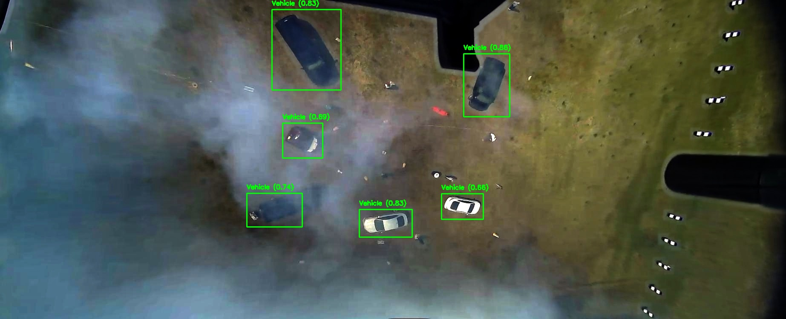
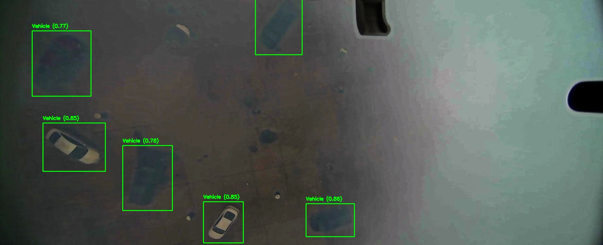

# Object Detection in Haze

This project aims to perform object detection on images affected by haze using the YOLOv8 model. It includes a pipeline for dehazing images, applying gamma correction, and generating text files with object detection results. 

This project was done as a submission for the 2024 CVPR UG2+ challenge under the Object detection in Haze track. 

## Table of Contents

- [Features](#features)
- [Installation](#installation)
- [Usage](#usage)
- [Examples](#examples)
- [Contributing](#contributing)
- [License](#license)

## Features

- Dehaze images using the dark channel prior algorithm
- Apply gamma correction to improve image contrast
- Perform object detection using the YOLOv8 model
- Generate text files with object detection results

## Installation

1. Clone the repository:
   ```
   git clone https://github.com/insertyourusernamehere/Zest.git
   ```

2. Install the required dependencies:
   ```
   pip install -r requirements.txt
   ```

3. Download the YOLOv8 ONNX model (`best.onnx`) and place it in the project directory.

## Usage

To run the object detection pipeline, use the following command:
```
python final.py --model best.onnx --input-folder /path/to/input/folder --output-folder /path/to/output/folder
```

- `--model`: Path to the YOLOv8 ONNX model file (default: `best.onnx`).
- `--input-folder`: Path to the folder containing input images.
- `--output-folder`: Path to the folder where output files will be saved (default: `results`).

The script will process the images in the input folder, apply dehazing and gamma correction, perform object detection, and save the results in the output folder.

## Examples

Here are a few examples of the object detection results:





## Contributing

Contributions are welcome! If you find any issues or have suggestions for improvements, please open an issue or submit a pull request.


